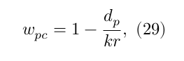

## Abstract

Photon-Mapping is a global illumination algorithm, consisting of two steps. The
first step is the creation of the photon-map data structure, by emitting photons
from the light sources of the scene and storing them when they hit different
objects. The second step is the rendering pass, where the created photon-map is
utilized to extract information about incoming flux and reflected radiance at
each point of the scene. 

Purpose of this project is the implementation of the Photon-Mapping Algorithm on
a CPU renderer. The implementation is tested on a variation of the Cornell Box
scene.

### Keywords

Global Illumination;Photon-Mapping;Ray-Tracing;CPU renderer;

### Table of Contents

1. [The test environment](#1-the-test-environment)

2. [Photon tracing](#2-photon-tracing)
        
    2.1 [Light source & Photon Emission](#21-light-source-&-photon-emission)

    2.2 [Intersection with triangles and spheres](#22-intersection-with-triangles-and-spheres)

    2.3 [Reflection, refraction and absorption](#23-reflection-refraction-and-absorption)

3. [Photon-map](#3-photon-map)

    3.1 [The balanced kd-tree data structure](#31-the-balanced-kd-tree-data-structure)

4. [Rendering Pass](#4-rendering-pass)

    4.1 [Ray tracing](#41-ray-tracing) 
        
    4.2 [Estimation of radiance](#42-estimation-of-radiance)

5. [Discussion & Conclusion](#5-discussion-&-conclusion)
    
    5.1 [Effect of different parameters](#51-effect-of-different-parameters)

    5.2 [Evaluation](#52-evaluation)

    5.3 [Optimizations](#53-optimizations)

## 1. The test environment

The implementation is tested on a variation of the Cornell Box. More
specifically, the scene includes a diffuse point of light, a box and a glass
sphere. The glass sphere is added, in order to demonstrate the reflection and
refraction of light. For simplicity the rest surfaces are assumed to be ideally
diffused.

All the surfaces except of the sphere are represented as triangles, using three
coordinates, a normal vector and a color. The sphere is represented by the
coordinates of its center and the length of its radius.

## 2. Photon Tracing

### 2.1 Light source & Photon Emission 

During the photon tracing pass photons are emitted from the light sources of the
scene, according to their distribution of emissive power. For instance, for a
diffuse point of light, the distribution is uniform across random directions of
the source. For the purposes of this project, a diffuse point of light is used,
whose implementation is based on the pseudocode of (Jensen & Christensen, 2000).

```
emit_photons_from_diffuse_point_light() {
    n_e = 0  //  number of emitted photons
    while (not enough photons) {
       // use simple rejection sampling to find 
       // diffuse photon direction
       do { 
            x = random number between -1 and 1
            y = random number between -1 and 1
            z = random number between -1 and 1
        } while ( x^2 + y^2 + z^2 > 1 )
        d = < x, y, z >
        p = light source position
        trace photon from p in direction d
        n_e = n_e + 1
    }
    scale power of stored photons with 1/n_e
}
```

### 2.2 Intersection with triangles and spheres

Photons emitted from the light sources intersect with the surfaces in the scene.

Assuming $v_0, v_1, v_2$ the coordinates of the edges of a triangle, in order to
describe a point in the triangle we construct a coordinate system that is
aligned with the triangle, with $v_0$ to be the origin. Thus,


Any point $r$ in the plane of the triangle can be described by $u, v$ such that


For the points included within the triangle the following equalities apply:


For each photon we store its origin point $o$  and direction $d$. Assuming $t$ a
scalar coordinate describing the position on a photon's path, all the points r on the
path can be written as


In order to find the intersection between the plane of the triangle and the line of the photon we combine the equations (3) and (7) and solve for the coordinates $t, u, v$:


The above equation can be formulated in 3x3 matrix notation as 


where


Checking the inequalities (eq. 4-6) with the coordinates $t, u, v$ for the
intersection point, we determine if the intersection is within the triangle.

In the case of intersection with sphere, a similar analytic solution was used. A
sphere can be described as 


where $x, y, z$ are the coordinates of a point $P$ and $R$ is the radius of the
sphere. The above equation can be rewritten as 


By substituting the equation of the photon's path with $P$, we get


which by developing the equation it becomes


The above equation is a quadratic function $f(x) = ax^2 + bx + c$, where with
$a=d^2$, $b=2*o*d$ and $c=o^2 − R^2$. Solving for $f(x)=0$ we can find the two
intersection points if exist.


Based on the discriminant (Δ), as illustrated in Fig. 1 there could be five
different cases (from left to right):

1. $Δ>0$, there are two solutions, thus the path of the photon intersects at two
   points with the sphere. In addition, the distances of the intersection points
   from the path's origin are both positive, which means that the origin is
   outside the sphere and the direction of the photon is towards the sphere.

2. $Δ=0$, there is one solution, thus the path of the photon intersects at a
   single point with the sphere.

3. $Δ>0$, there are two solutions, thus the path of the photon intersects at two
   points with the sphere. However, in contrast with case (1), the distance of
   one of the intersection points from the photon path's origin is negative and
   the other is positive, which means that the origin is inside the sphere.

4. $Δ<0$, there are not any solutions, i.e., the path of the photon does not
   intersect with the sphere. 

5. $Δ>0$, there are two solutions, thus the path of the photon intersects at two
   points with the sphere. However, both intersection points have negative
   distance from the photon path's origin, which means that the origin is
   outside of the sphere and its direction points away from it.

For cases (4) and (5) the photon does not intersect with the
sphere.


### 2.3 Reflection, refraction and absorption 

Once a photon is emitted from the light source, it is traced in the scene. Each
photon is stored at diffuse surfaces and can either be reflected, refracted by
the glass sphere or absorbed. In the case of diffuse surfaces, a simplification
of the statistical technique of *Russian roulette* (Avro & Kirk, 1990) is
used, by randomly deciding if a ray is absorbed or reflected. For instance, when
a photon hits a surface, other than the sphere, the photon is reflected if it
has not bounced in any surface so far, or if a random sample is less than the
predefined reflectance probability. Otherwise the photon is absorbed and no
longer traced.

```
if (photon.bounces == 0 || GetRandomNum(0) < 0.5)
    TracePhoton(p);
```

For the purposes of this project, we assume ideally diffused surfaces, i.e.,
every ray of light incident on the surface is scattered equally in all
directions. The reflection of light is simulated using Monte Carlo integration,
by sampling the Bidirectional Reflectance Distribution Function (BRDF), which in
the case of ideally diffused surfaces, BRDF is uniform. In other words, a
uniformly random direction is selected for the reflected light. The following
pseudocode is used to calculate a random new direction given the normal (n) of
the surface (Zhao, 2017).

```
uniform_random_dir(n) {
    z = sqrt(rand())
    r = sqrt(1.0 - z * z)
    phi = 2.0 * pi * rand()
    x = r * cos(phi)
    y = r * sin(phi)
    [u, v, w] = create local (orthogonal) coordinate
                system around n
    return x*u + y*v + z*w
}
```

In the case a photon hits the sphere, then the Fresnel coefficient is used to
decide if the photon will be reflected or refracted. The Fresnel equation
describes how much light is reflected and how much is refracted, by considering
the angle of incidence. For example, when a photon hits the edges of the sphere,
it is most probable to be reflected, whereas incident photons in the center to
be refracted. Schlick's approximation formula was used to approximate the
contribution of the Fresnel factor (Schlick, 1994). The specular reflection
coefficient was calculated by:


Considering the approximated Fresnel coefficient $R$, a photon is randomly either
secularly reflected or refracted.

```
if(GetRandomNum() < R)
    Reflect photon
else
    Refract photon
```

The direction after specular reflection is calculated by 


where $d$ is the photon's direction and $N$ the normal of the intersected surface.

Direction after refraction is calculated by 


where $theta_i$ is the angle of incidence, $N$ the surface normal, $n_1$ and $n_2$ are the
indices of refraction which characterize the travel speed of light in different
materials. For this project we assumed index of refraction equal to 1.75, i.e.,
1.0 for the air and 1.75 for the glass materials.

The above equation can be rewritten as (Scratchapixel, 2014a),


Thus, 


The calculation of refraction of light is calculated two times, when the photon
enters the sphere and when exits. Thus, in order to calculate the final
intersection point of the photon after intersecting with the sphere, first we
calculate the first direction of the photon after refraction, then given that
direction and the intersection point, a second intersection is calculated, where
the photon will exit, resulting in a new direction using the same above
equations. At the end, using the exit point and the final direction, we
calculate the closest intersection with other objects in the scene.

![Illustration of tracing photons emitted from the light source. Each line represents the path of a photon from its origin to the intersection point. The color of the lines is based on the photon's energy. Notice that when a photon hits the red (left) or blue (right) wall, changes color. The illustration does not take into account the intersection point with the sphere, only the final destination after reflection/refraction, so the paths of the photons intersected with the sphere are shown as straight lines, even though this is not the case. ](./figures/02.bmp)

Each time a photon hits a surface, a certain amount of its energy is absorbed. This is simulated by multiplying the current energy of the photon with the color of intersecting surface. This creates the color bleeding effect, i.e., surfaces to be colored by the reflections of colored light due to other nearby surfaces.


Considering all the above, photon tracing could be summarized in the following
pseudocode:

```
trace_photon( photon p ) {
    Find closest intersection

    if p intersects with the sphere
        if(GetRandomNum() < Fresnel Coefficient)
            Reflect photon 
            Calculate new intersection point
        else
            Refract photon 
            Calculate new intersection point

        Add photon to the photon-map
    else
        if photon p bounces > 0
            Add photon to the photon-map


    if photon p  bounces==0 OR GetRandomNum() < 0.5
        Create a new photon from current 
        intersection and random direction
        
        trace_photon(p_new)
}
```

## 3. Photon-map

Photons are added to a list (a `vector` data structure) when they intersect with
diffuse surfaces either after they were refracted or reflected by the sphere or
other surface.

After building the photon-map, we can later use it in the rendering pass to 
compute estimates of the incoming flux and the reflected radiance at
the points in the scene. To do this, it is necessary to locate the nearest
photons in the photon-map. Because this operation is required to be done
very often, we can optimized the representation of the photon-map before the
rendering pass, by using the *kd-tree* data structure.

### 3.1 The balanced kd-tree data structure

The k-dimensional tree (kd-tree) is a binary search tree data structure used for
organizing coordinates in a k-dimensional space, and allows us to perform
efficient nearest neighbor search. In our case, we work with 3-dimensional
space.

Once all the photons are traced, the kd-tree is built by selecting as a current
non-leaf node the median point according to a certain axis and recursively
repeating the same procedure for the left and right node with coordinates that
are on the before and after the median point, respectively. The axis in each
case is selected by calculating the depth of the current node modulo the total
number of dimensions (3). The construction of the kd-tree can be outlined by the
following pseudocode.

```
node *build_kdtree ( list of points, int depth )
{
    Select axis by (depth modulo 3)
    Sort points based on selected axis
    Find median of the points in selected axis
    Set current node to be the median

    s1 = all points below median
    s2 = all points above median
    node.left  = build_kdtree(s1, depth+1)
    node.right = build_kdtree(s2, depth+1)

    return node
}
```

An alternative way for balancing the kd-tree was proposed by (Jensen, 1996), in
which the splitting axis is based on the distribution of points within the list
instead of just the current depth of the tree. More specifically, Jensen
proposed to use either the variance or the maximum distance between the points
as a criterion.

Later during the rendering process, given a certain point in the scene, we query
the kd-tree and search for the $n$ nearest-neighbor photons of the photon-map
with our query point. For that purpose, we use a priority queue of size $n$,
where the included photons are sorted in descending based on their squared
distance from the query point.

The search begins from the root of the tree and recursively traverses the tree.
Similar to the balancing procedure depending on the splitting axis, if the query
point is before or after the median, the left or right child node is examined,
respectively. Each node under examination is added to the queue, and every time
we ensure that its size remains less or equal to $n$ by removing the furthest
node. In the case, we reached the leaves and the size of the queue is less than
the required one, we continue by examining the siblings of the current node. The
search procedure is summarized by the following pseudocode.

```
search( node, query_point, queue, n ) {
  Add node to queue

  if size of queue > n
    Pop first element

  if query_point is before node
    search(node.left, query_point, queue, n)
  else 
    search(node.right, query_point, queue, n)

  if distance to sibling of node to query_point < queue.top
    if query_point is before node
      search(node.right, query_point, queue, n)
    else 
      search(node.left, query_point, queue, n)
}
```

The implementation of the kd-tree was adopted with slight modifications from
(YumcyaWiz, 2021).

## 4. Rendering Pass

### 4.1 Ray tracing 

The scene is rendered using basic ray-tracing, i.e., for each pixel of the final
image we trace a ray from the position of the camera towards the scene. The
color of the pixel is determined by the estimated radiance of the point at the
closest intersection with of the scene with the ray. We assume that the camera
is aligned with the coordinate system of the model with x-axis pointing to the
right and y-axis pointing down and z-axis pointing forward into the image.

Note that the photon-map, already constructed, is view independent, and
therefore it can be utilized to render the scene from any view of the camera. 

### 4.2 Estimation of radiance

As noted previously, photons are added to the photon-map after they are
reflected/refracted by any surface. Thus, the calculation of the direct lighting
is done separately for more accuracy. Since we use a diffuse point of light, the
light spreads uniformly around the source, as a sphere. Taking this into
account, a surface that is positioned closer to the light source receive more
light. In addition, we consider the angle between the direction of light and the
surface. A surface that directly faces the light source receives more light than
if there was a certain angle less than 90 degrees. Taking the above into
account, the contribution of the direct light is calculated by 


where vector $P$ describes the energy of emitted light per time unit, $r$ is the
distance of the surface from the light source, $\hat{n}$ is the unit vector
describing the normal of the surface and $\hat{r}$ is a unit vector describing
the direction from the surface to the light source.

Indirect illumination is calculated based on the information of the photon-map.
Given a certain point at a surface we accumulate the energy stored by the $n$
nearest photons. In addition, a cone-filter is used in order to reduce the
amount  of blur at the edges of the objects. The cone-filter assigns a weight to
each photon depending on the distance between the intersection point of the
photon $p$ and the surface point $x$ (Jensen, 1996). The weight is defined as,



where $d_p$ is the distance between the surface point $x$ and the photon $p$,
$k$ is a constant of the filter (assigned a value of 1.2 in our case) and $r$ is
the maximum distance that the $N$ photons have from the surface point $x$.
Considering also the normalization of the filter ($1-\frac{2}{3k}$) the filtered
radiance estimate is defined as (eq.11 from Jensen & Christensen, 2000):


where $f_r(x, \vec{\omega_p})$ is the is the BRDF, which in the case of ideally
diffuse surfaces is uniform, and $\Delta \Phi_p(x,\vec{\omega_p})$ is the power
of photon $p$. Similar to the calculation of the direct illumination (eq. 28),
the angle of intersection was also taken into account in the evaluation of the
power of each photon.

In case the ray of the camera intersects with the glass sphere the approximation
of the Fresnel coefficient (eq. 19) is used to determine the contribution of
specularly reflected and refracted light, i.e., the radiance is separately
calculated for the case of specular reflection and refraction and then
normalized by the Fresnel coefficient. This results in more visible reflection
close to the edges of the sphere compared to its center.


## 5. Discussion & Conclusion

### 5.1 Effect of different parameters 

Due to the time constraints, the experiments with the algorithm were very
limited, and there was not a thorough examination of the effects that the
different parameters of the algorithm could have on the final rendering image.
Future work could include a more detailed study of how a cone- or
gaussian-filter improve the outcome; how the number of nearest neighbor photons
and the number of total emitted photons affect the result and execution time
etc.

### 5.2 Evaluation/Perceptual Study

One of the strongest points of photon-mapping is its ability to track photons
and estimate accurately projected caustics onto the surfaces. Moreover, as
demonstrated by Fig. 5 and discussed previously, the index of refraction of the
objects and the magnitude of the Fresnel coefficient determine how the light can
be reflected or refracted and can result in more glossier objects. 

An interesting topic could be to study how caustics projected by an object onto
a different surface, affect the judgement of translucency and at what degree.
Another relevant research question could be what elements contribute to a
realistic rendering of translucent objects.

A related study by Gigilashvili et al. (2018) suggested that for assessing the
degree of translucency of an object, participants of the study paid more
attention on the elements elsewhere in the scene, such as light patterns created
by caustic. This fact clearly indicates that in order to infer translucency of
an object by understanding the created caustics, requires a higher level
understanding of the scene.

For the purposes of a perceptual study, the participant could be asked to sort a
series of images based on the degree of realism or translucency of the objects.
The set of images could include produced renders using different parameters,
e.g, index of refraction, caustics, BRDFs etc. Furthermore, it could be
interesting to track the eye movements of the participants during the task, in
order to verify the findings of the previous studies.

### 5.3 Optimizations

Main focus of this project was the implementation of the Photon-Mapping
algorithm and understanding of the fundamentals of Computer Graphics. Thus,
different assumptions were taken to simplify the problem. A more complex model
of light emission and BRDFs could have been selected for a more realistic
result. 

In addition, performance was out of the scope of this work, which might resulted
in a non-efficient implementation. Photon emission could have been optimized
using projection maps (Jensen & Christensen, 2000). A projection map would
significantly increase the speed of the computation and it would allow to
determine which directions are more important and ensure that the emission of
photons in that direction, e.g, caustics. A lot of the operations like the
photon and ray tracing can run independently. Thus, parallel processing taking
advantage of CPU or GPU multi-threading could significantly decrease the
execution time.

Furthermore, space complexity was also not taken into consideration. The
definition of the photon instance could have been optimized for less space, and
a heap data structure could have been used to represent the kd-tree, which would
not require to explicitly store pointers or indices of the sub-trees for each
node.

## References

Avro, J., & Kirk, D. B. (1990). Particle transport and image synthesis in computer graphics. In SIGGRAPH’90: Proceedings of 17th Conference on Computer Graphics and Interactive Techniques (pp. 63-66).

Gigilashvili, D., Thomas, J.-B., Hardeberg, J. Y., & Pedersen, M. (2018). Behavioral investigation of visual appearance assessment. In Proceedings of the Twenty-sixth Color and Imaging Conference (CIC26). Vancouver, Canada (pp. 294–299). Society for Imaging Science and Technology, doi:10.2352/ISSN.2169-2629.2018.26.294.

Jensen, H. W., & Christensen, N. J. (2000). A practical guide to global illumination using photon-maps. SIGGRAPH 2000 Course.

Jensen, H. W.(1996) The photon-map in global illumination. Ph.D. dissertation, Technical University of Denmark.

Schlick, C. (1994). An inexpensive BRDF model for physically‐based rendering. In Computer graphics forum (Vol. 13, No. 3, pp. 233-246). Edinburgh, UK: Blackwell Science Ltd.

Scratchapixel, (2014). Introduction to shading (reflection, refraction and Fresnel). Retrieved May 1, 2022, from https://www.scratchapixel.com/lessons/3d-basic-rendering/introduction-to-shading/reflection-refraction-fresnel 

Scratchapixel, (2014). A minimal ray-tracer: Rendering simple shapes (ray-sphere intersection). Retrieved May 1, 2022, from https://www.scratchapixel.com/lessons/3d-basic-rendering/minimal-ray-tracer-rendering-simple-shapes/ray-sphere-intersection 

YumcyaWiz, (2021) Photon_mapping Retrieved May 1, 2022 from Github repository https://github.com/yumcy aWiz/photon_mapping

Zhao, S. (2017). Rendering Equation & Monte Carlo Path Tracing. CS295, Spring 2017, University of California, Irvine. 
